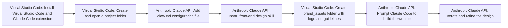

# Building Beautiful Websites with Claude Code Is Too Easy

**Use Case:** Development Ops
**Skill Level:** ⭐ Beginner
**Estimated Cost:** $20/month for Claude Pro or $200/month for Claude Max subscription
**Complexity:** Low
**Value Score:** 8/10
**Source:** [Nate Herk](https://www.youtube.com/watch?v=86HM0RUWhCk)
**Published:** 2026-02-19

## Overview

A workflow for building professional, branded websites using Claude Code (Anthropic's AI coding agent) within Visual Studio Code. The process uses a custom claw.md configuration file, front-end design skills, and brand assets to generate modern landing pages and websites without traditional coding.

## Tech Stack

- **Anthropic Claude API**
- **Visual Studio Code**

## Workflow Diagram

## Step-by-Step

1. **[Visual Studio Code]** Install Visual Studio Code and Claude Code extension
   - Download VS Code, install the Claude Code extension from the extensions marketplace, and authenticate with Anthropic Pro or Max subscription
2. **[Visual Studio Code]** Create and open a project folder
   - Create a new folder on your desktop or documents for the website project and open it in VS Code
3. **[Anthropic Claude API]** Add claw.md configuration file
   - Create or download a claw.md file that acts as a system prompt, instructing Claude Code to always invoke the front-end design skill before writing front-end code
4. **[Anthropic Claude API]** Install front-end design skill
   - Run commands to install the front-end design skill globally, which helps Claude generate modern, professional designs instead of basic AI-generated layouts
5. **[Visual Studio Code]** Create brand_assets folder with logo and guidelines
   - Add a folder containing brand assets like logos, color palettes, typography guidelines, and icons for Claude to reference
6. **[Anthropic Claude API]** Prompt Claude Code to build the website
   - Give a simple prompt like 'build me a modern and professional landing page for [company name]' and Claude will reference the claw.md, skills, and brand assets to generate code
7. **[Anthropic Claude API]** Iterate and refine the design
   - Review the generated website, provide feedback, and update the claw.md file as needed throughout the project

## When to Use This

- Building landing pages or simple websites quickly without extensive coding knowledge
- Creating branded web experiences when you have design assets but limited development resources
- Prototyping website designs rapidly for client presentations or MVPs
- Generating modern, professional-looking websites with animations and dynamic elements

- Building complex web applications with extensive backend logic and database integrations
- Projects requiring highly custom functionality that AI agents struggle to implement
- When you need pixel-perfect designs that match exact specifications
- Production applications requiring extensive testing and security audits

## Alternatives

- Traditional web development with frameworks like React, Vue, or Next.js
- No-code website builders like Webflow, Framer, or Wix
- Hiring a professional web developer or agency
- Using other AI coding assistants like GitHub Copilot or Cursor IDE

## Next Steps

- [ ] Test this workflow
- [ ] Customize for your use case
- [ ] Integrate with existing systems
