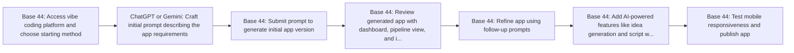

# Vibe Coding Explained for Beginners - Build Apps with AI

**Use Case:** Content Pipeline
**Skill Level:** ⭐ Beginner
**Estimated Cost:** Base 44 subscription (pricing varies by plan) + potential AI API costs for integrated features
**Complexity:** Low
**Value Score:** 8/10
**Source:** [Skill Leap AI](https://www.youtube.com/watch?v=7HErPVFNO0Q)
**Published:** 2026-02-19

## Overview

A vibe coding workflow that uses natural language prompts to build a custom YouTube content management system without traditional coding. The system manages the entire video production pipeline from ideation through publishing, with user authentication and AI-powered script generation capabilities.

## Tech Stack

- **Base 44**
- **ChatGPT**
- **Gemini**

## Workflow Diagram

## Step-by-Step

1. **[Base 44]** Access vibe coding platform and choose starting method
   - Can start with blank slate, upload screenshot for design reference, or use planning mode for AI-assisted planning
2. **[ChatGPT or Gemini]** Craft initial prompt describing the app requirements
   - Optional: Use LLM to brainstorm and refine prompt before submitting. Include features like user authentication, workflow stages, and AI integrations
3. **[Base 44]** Submit prompt to generate initial app version
   - Platform automatically creates implementation plan including features, flow, design language, and components
4. **[Base 44]** Review generated app with dashboard, pipeline view, and idea management pages
   - App includes authentication, multi-page navigation, mobile optimization, and workflow stages (idea to research to production to publishing)
5. **[Base 44]** Refine app using follow-up prompts
   - Make iterative improvements to design, functionality, and features using natural language refinement prompts
6. **[Base 44]** Add AI-powered features like idea generation and script writing
   - Integrate AI capabilities directly into the app for content creation assistance
7. **[Base 44]** Test mobile responsiveness and publish app
   - Review mobile view and deploy for team use with individual user accounts

## When to Use This

- Need custom internal tools but lack coding expertise
- Managing complex content production workflows across teams
- Want rapid prototyping of business applications
- Existing tools don't match your specific workflow needs
- Need multi-user apps with authentication and role management

- Require highly specialized or complex backend logic
- Need deep integration with legacy enterprise systems
- Building apps that require real-time performance at scale
- Security requirements exceed no-code platform capabilities

## Alternatives

- Use existing project management tools like Notion, Asana, or Monday.com
- Hire developer to build custom solution
- Combine no-code tools like Airtable with automation platforms like Make.com or Zapier
- Use other vibe coding platforms like Replit, Cursor, or v0.dev

## Next Steps

- [ ] Test this workflow
- [ ] Customize for your use case
- [ ] Integrate with existing systems
