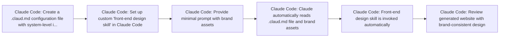

# 5 Claude Code Hacks to Build Beautiful Websites

**Use Case:** Development Ops
**Skill Level:** ⭐⭐ Intermediate
**Estimated Cost:** $20/month for Claude Pro subscription (includes Claude Code access)
**Complexity:** Medium
**Value Score:** 8/10
**Source:** [Nate Herk](https://www.youtube.com/watch?v=HF7eymL2-MM)
**Published:** 2026-02-19

## Overview

A development workflow using Claude Code with custom configuration files (.claud.md) and skills to automate front-end website design and development. The system uses a custom 'front-end design skill' that is automatically invoked before any front-end code generation, creating complete landing pages with brand-consistent design from minimal prompts.

## Tech Stack

- **Anthropic Claude API**
- **Claude Code**

## Workflow Diagram

## Step-by-Step

1. **[Claude Code]** Create a .claud.md configuration file with system-level instructions
   - Acts as a system prompt that Claude reads before every request. Include rule: 'always invoke the front-end design skill before writing any front-end code every session'
2. **[Claude Code]** Set up custom 'front-end design skill' in Claude Code
   - Skills are custom instructions that provide specialized capabilities for specific tasks like front-end design
3. **[Claude Code]** Provide minimal prompt with brand assets
   - Example: 'Build me a modern and professional landing page for [Brand Name]' plus brand guidelines and logo
4. **[Claude Code]** Claude automatically reads .claud.md file and brand assets
   - System processes configuration and context before generating code
5. **[Claude Code]** Front-end design skill is invoked automatically
   - Generates complete landing page structure with nav, hero, features, stats, etc.
6. **[Claude Code]** Review generated website with brand-consistent design
   - Output includes matching colors, typography, logo integration, animations, and complete one-page layout

## When to Use This

- Building landing pages or websites quickly with consistent branding
- Prototyping front-end designs without extensive manual coding
- Creating brand-consistent web interfaces from minimal specifications
- Automating repetitive front-end development tasks with custom rules

- Complex web applications requiring extensive backend integration
- Projects requiring pixel-perfect design control
- When you need full control over every design decision
- Production applications without human review and refinement

## Alternatives

- Using traditional front-end frameworks with component libraries
- Hiring a web designer/developer
- Using website builders like Webflow or Framer
- Using other AI coding assistants like GitHub Copilot or Cursor with custom prompts

## Next Steps

- [ ] Test this workflow
- [ ] Customize for your use case
- [ ] Integrate with existing systems
