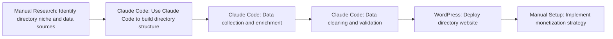

# Claude Code built me a $273/Day online directory

**Use Case:** Content Pipeline
**Skill Level:** ⭐⭐ Intermediate
**Estimated Cost:** $200-1000 initial investment + $20-50/month hosting + Claude API costs
**Complexity:** Medium
**Value Score:** 8/10
**Source:** [Greg Isenberg](https://www.youtube.com/watch?v=I_wbc5ND79o)
**Published:** 2026-02-16

## Overview

This workflow uses Claude Code (Anthropic's AI coding assistant) to build automated online directories that generate passive income through organic traffic. The process emphasizes data collection, enrichment, and cleaning to create valuable directory websites that monetize through lead generation, advertising, or vertical SaaS products.

## Tech Stack

- **Claude Code**
- **WordPress**

## Workflow Diagram

## Step-by-Step

1. **[Manual Research]** Identify directory niche and data sources
   - Research profitable directory niches (funeral homes, senior living, gas prices, etc.) that have strong lead generation or advertising potential
2. **[Claude Code]** Use Claude Code to build directory structure
   - Prompt Claude Code to generate the website architecture, database schema, and frontend interface for the directory
3. **[Claude Code]** Data collection and enrichment
   - Use Claude Code to scrape, aggregate, and enrich data from various sources. This is described as the hardest and most valuable part of the process
4. **[Claude Code]** Data cleaning and validation
   - Clean and validate collected data to ensure quality and accuracy for the directory listings
5. **[WordPress]** Deploy directory website
   - Deploy the directory on WordPress or similar platform to generate organic traffic on autopilot
6. **[Manual Setup]** Implement monetization strategy
   - Set up lead generation forms, advertising integrations, or develop complementary vertical SaaS products

## When to Use This

- Building passive income businesses with limited capital ($200-1000)
- Creating data-driven websites that generate organic traffic
- Establishing a traffic base before building SaaS products
- Entering markets with strong lead generation potential (senior living, funeral homes, local services)
- Building vertical SaaS businesses with built-in customer acquisition

- When you need immediate revenue (directories take time to build traffic)
- In highly saturated directory markets without unique data angles
- When you cannot access or legally scrape quality data sources
- If you lack patience for SEO and organic growth strategies

## Alternatives

- Manual directory building with no-code tools like Webflow or Bubble
- Using existing directory templates and plugins for WordPress
- Building directories with traditional web development instead of AI coding
- Purchasing existing directories and improving them
- Using specialized directory builders like Brilliant Directories

## Next Steps

- [ ] Test this workflow
- [ ] Customize for your use case
- [ ] Integrate with existing systems
