# 3 years into the AI Agency model. Where it’s all going…

**Use Case:** Development Ops
**Skill Level:** ⭐⭐⭐ Advanced
**Estimated Cost:** $5 per GitHub issue/feature + infrastructure costs (estimated $100-500/month for hosting and API calls)
**Complexity:** High
**Value Score:** 10/10
**Source:** [Liam Ottley](https://www.youtube.com/watch?v=8JLyq_-3n58)
**Published:** 2026-02-18

## Overview

An end-to-end automated engineering system that uses multiple AI agents (planning, building, testing, reviewing, documentation) to autonomously develop software features. The system processes GitHub issues overnight, ships code to production, and operates at approximately $5 per issue resolved, dramatically reducing software development costs and time.

## Tech Stack

- **AI Agents**
- **GitHub**
- **Custom Engineering System**

## Workflow Diagram

```mermaid
graph LR
    A[GitHub: Create and queue GitHub issues for features needed]
    A --> B[AI Agents: Planning agent analyzes requirements and creates implemen...]
    B --> C[AI Agents: Building agent writes code based on the plan]
    C --> D[AI Agents: Testing agent runs automated tests on the code]
    D --> E[AI Agents: Reviewing agent performs code review]
    E --> F[AI Agents: Documentation agent creates technical documentation]
    F --> G[GitHub: System ships completed features to production]
    G --> H[Custom App: Human reviews completed work and tests in production]
```

## Step-by-Step

1. **[GitHub]** Create and queue GitHub issues for features needed
   - Issues represent specific features or functionality to be built
2. **[AI Agents]** Planning agent analyzes requirements and creates implementation plan
   - Agent breaks down the feature into actionable development tasks
3. **[AI Agents]** Building agent writes code based on the plan
   - Generates actual code implementation for the feature
4. **[AI Agents]** Testing agent runs automated tests on the code
   - Validates functionality and catches bugs
5. **[AI Agents]** Reviewing agent performs code review
   - Checks code quality, standards, and best practices
6. **[AI Agents]** Documentation agent creates technical documentation
   - Generates docs for the implemented features
7. **[GitHub]** System ships completed features to production
   - Automated deployment of tested and reviewed code
8. **[Custom App]** Human reviews completed work and tests in production
   - Final validation and feedback collection for iteration

## When to Use This

- Building custom internal tools or MVPs for clients
- Rapid prototyping and iteration on software features
- Reducing software development costs by 90%+
- Scaling development capacity without hiring more engineers
- Creating economically viable software that was previously too expensive

- Mission-critical systems requiring extensive human oversight
- Highly regulated industries with strict compliance requirements
- Projects requiring deep domain expertise that AI agents lack
- When you need guaranteed delivery timelines for complex features

## Alternatives

- Traditional software development with human engineers
- Low-code/no-code platforms for simpler applications
- Hybrid approach with AI-assisted development but human oversight at each step
- Off-the-shelf SaaS solutions instead of custom development

## Next Steps

- [ ] Test this workflow
- [ ] Customize for your use case
- [ ] Integrate with existing systems
