# Agent memory resolved?

**Use Case:** Development Ops
**Skill Level:** ⭐⭐⭐ Advanced
**Estimated Cost:** $0/month (open source framework) + standard LLM API costs
**Complexity:** High
**Value Score:** 9/10
**Source:** [AI Jason](https://www.youtube.com/watch?v=pAIF7vZm5k0)
**Published:** 2026-02-18

## Overview

A memory management framework for AI coding agents that uses a Git-like structure to persist context across sessions. The system maintains hierarchical memory files (main.md, branch folders, commit.md, log.md, metadata) that allow agents to remember previous work, explore alternative approaches, and accumulate knowledge over time, improving performance by 13% on software engineering tasks.

## Tech Stack

- **Git Context Controller**
- **Claude Code**
- **Cursor**
- **OpenAI API**
- **Anthropic Claude API**

## Workflow Diagram

```mermaid
graph LR
    A[Git Context Controller: Initialize global context]
    A --> B[Git Context Controller: Create branch for approach]
    B --> C[Git Context Controller: Log conversation history]
    C --> D[Git Context Controller: Commit milestones]
    D --> E[Git Context Controller: Create alternative branches]
    E --> F[Git Context Controller: Merge completed work]
    F --> G[Git Context Controller: Progressive retrieval]
    G --> H[Git Context Controller: Share across agents]
```

## Step-by-Step

1. **[Git Context Controller]** Initialize global context
   - Create main.md file to store global project context and roadmap in repository folder
2. **[Git Context Controller]** Create branch for approach
   - When agent decides on a strategy (e.g., Playwright script), create branch folder with commit.md, log.md, and metadata files
3. **[Git Context Controller]** Log conversation history
   - Automatically save all conversation messages, observations, and actions to log.md file in branch folder
4. **[Git Context Controller]** Commit milestones
   - When agent completes subtasks, update commit.md with summary and optionally revise main.md
5. **[Git Context Controller]** Create alternative branches
   - If approach fails, create new branch (e.g., API-based) to explore alternative strategy without losing context
6. **[Git Context Controller]** Merge completed work
   - Merge commit.md into main.md, combine log.md files, and update main.md with high-level summary
7. **[Git Context Controller]** Progressive retrieval
   - Agent can fetch main.md for overview, then dive into specific branch folders for detailed context
8. **[Git Context Controller]** Share across agents
   - Memory files persist across different coding agent sessions (Claude Code, Cursor) and can be accessed via Slack/Telegram

## When to Use This

- Long-running complex coding projects that exceed context window limits
- Multi-session development work where agents need to remember previous attempts
- Team environments where knowledge needs to accumulate across different agent sessions
- Projects requiring exploration of multiple alternative approaches
- When using smaller/cheaper models that need context augmentation to match frontier model performance

- Simple one-off coding tasks that fit within standard context windows
- Projects where setup overhead exceeds benefit
- When working with agents that don't support custom memory frameworks
- Rapid prototyping where memory persistence isn't critical

## Alternatives

- Claude Code's built-in memory.md feature (project-specific only)
- RAG-based context retrieval systems
- Manual context management through detailed prompts
- Vector database solutions for semantic memory search
- Session-based context compression techniques

## Next Steps

- [ ] Test this workflow
- [ ] Customize for your use case
- [ ] Integrate with existing systems
