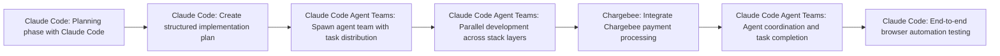

# How to Properly Use Claude Code Agent Teams (FULL LIVE BUILD)

**Use Case:** Development Ops
**Skill Level:** ⭐⭐⭐ Advanced
**Estimated Cost:** High token usage - estimated $50-200+ per complex feature build due to multiple agents running simultaneously with communication overhead
**Complexity:** High
**Value Score:** 8/10
**Source:** [Cole Medin](https://www.youtube.com/watch?v=uvs1Igr4u6g)
**Published:** 2026-02-16

## Overview

A development workflow using Claude Code's Agent Teams feature to build a complete payment integration into an existing agentic chat application. Multiple AI agents work in parallel on frontend, backend, and database changes while autonomously communicating with each other to coordinate tasks, implementing token-based billing where users purchase tokens to interact with the chat agent.

## Tech Stack

- **Claude Code (Anthropic)**
- **Chargebee**
- **Supabase**

## Workflow Diagram

## Step-by-Step

1. **[Claude Code]** Planning phase with Claude Code
   - Interactive planning session where Claude asks clarifying questions to understand requirements for payment integration feature
2. **[Claude Code]** Create structured implementation plan
   - Generate detailed plan covering database schema changes, authentication, frontend billing page, and backend token consumption logic
3. **[Claude Code Agent Teams]** Spawn agent team with task distribution
   - Main agent spawns multiple teammate agents that share a task list and can communicate directly with each other without going through main agent
4. **[Claude Code Agent Teams]** Parallel development across stack layers
   - Agents work simultaneously on database schema (adding transactions and tokens), frontend (billing page), backend (token consumption), and authentication (Supabase integration)
5. **[Chargebee]** Integrate Chargebee payment processing
   - Use Chargebee skill/integration in Claude Code to implement payment processing without hallucinations due to training cutoff
6. **[Claude Code Agent Teams]** Agent coordination and task completion
   - Agents autonomously coordinate who handles which tasks, communicate progress, and knock off completed items from shared task list
7. **[Claude Code]** End-to-end browser automation testing
   - Automated testing of the complete payment flow from token purchase through consumption in chat interactions

## When to Use This

- Building complex features that span multiple layers of the stack (frontend, backend, database)
- When you need parallel development on independent but coordinated tasks
- Production-grade feature implementation that requires touching multiple parts of codebase simultaneously
- When speed of development is more important than token cost optimization

- Simple single-file or single-layer changes where sub-agents would suffice
- When you need highly deterministic, predictable behavior
- Budget-constrained projects where token costs are a primary concern
- Current state (as of video): Not ready for production-grade software due to non-deterministic behavior and reliability issues

## Alternatives

- Traditional sub-agents approach where main agent coordinates but agents don't communicate peer-to-peer
- Sequential development with single Claude Code agent
- Cursor IDE with similar agentic capabilities
- Manual development with AI assistance for specific tasks rather than full autonomous teams

## Next Steps

- [ ] Test this workflow
- [ ] Customize for your use case
- [ ] Integrate with existing systems
