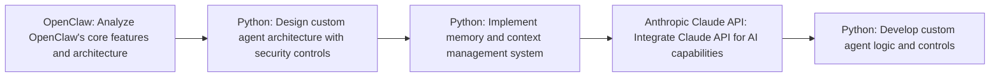

# I Built a Safer OpenClaw Alternative Using Claude Code

**Use Case:** Personal Productivity
**Skill Level:** ⭐⭐⭐ Advanced
**Estimated Cost:** $20-100/month for Claude API usage depending on interaction volume
**Complexity:** High
**Value Score:** 8/10
**Source:** [Cole Medin](https://www.youtube.com/watch?v=ys-JtUlYDBg)
**Published:** 2026-02-18

## Overview

A custom-built personal AI assistant alternative to OpenClaw that maintains memory of user preferences and work context over time. Built using Python and Claude API with enhanced security controls compared to the open-source OpenClaw project.

## Tech Stack

- **Anthropic Claude API**
- **Python**

## Workflow Diagram

## Step-by-Step

1. **[OpenClaw]** Analyze OpenClaw's core features and architecture
   - Study the open-source repository to understand what makes it feel magical - persistent memory, context awareness, and personalization
2. **[Python]** Design custom agent architecture with security controls
   - Create a more controlled version that addresses security concerns while maintaining core functionality
3. **[Python]** Implement memory and context management system
   - Build system to track user preferences, work context, and conversation history over time
4. **[Anthropic Claude API]** Integrate Claude API for AI capabilities
   - Use Claude as the underlying LLM for natural language understanding and generation
5. **[Python]** Develop custom agent logic and controls
   - Write approximately 2000+ lines of Python code and markdown to replicate OpenClaw functionality with better security

## When to Use This

- When you need a personalized AI assistant with memory and context awareness
- When security and control over your AI agent is a priority
- When you want to customize assistant behavior to your specific needs
- When you have Python development skills and want full ownership of the solution

- If you lack Python programming experience
- If you need a quick plug-and-play solution without customization
- If you're comfortable with OpenClaw's security model and don't need custom features
- If you don't want to maintain custom code

## Alternatives

- Use OpenClaw directly if security concerns are acceptable
- Use commercial AI assistant platforms like ChatGPT Plus with custom instructions
- Build with no-code agent builders like Relevance AI or VoiceFlow
- Use LangChain or CrewAI frameworks for faster agent development

## Next Steps

- [ ] Test this workflow
- [ ] Customize for your use case
- [ ] Integrate with existing systems
