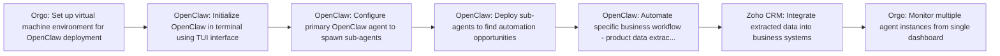

# Making $$$ with OpenClaw

**Use Case:** Sales Automation
**Skill Level:** ⭐⭐⭐ Advanced
**Estimated Cost:** $50-200/month for VM hosting (Orgo or alternatives) + OpenAI API costs ($20-100/month depending on usage) + potential Upwork fees (10-20% of project value)
**Complexity:** High
**Value Score:** 9/10
**Source:** [Greg Isenberg](https://www.youtube.com/watch?v=i13XK-uUOLQ)
**Published:** 2026-02-18

## Overview

Deploy multiple OpenClaw AI agent instances in virtual environments to automate business tasks like data extraction, CRM updates, and lead generation. The workflow demonstrates using OpenClaw to spawn sub-agents that can autonomously find opportunities on Upwork, scrape product data, and populate CRM systems while running 24/7.

## Tech Stack

- **OpenClaw**
- **Orgo**
- **Upwork**
- **Zoho CRM**
- **Mac Mini**

## Workflow Diagram

## Step-by-Step

1. **[Orgo]** Set up virtual machine environment for OpenClaw deployment
   - Create multiple computer instances (up to 5+ shown) to run parallel OpenClaw agents. Alternative platforms mentioned: Manis, Kimmy, or local Mac Mini
2. **[OpenClaw]** Initialize OpenClaw in terminal using TUI interface
   - Launch OpenClaw terminal interface on each virtual machine instance to create dedicated AI agents
3. **[OpenClaw]** Configure primary OpenClaw agent to spawn sub-agents
   - One main OpenClaw instance can spawn up to 8 sub-agents, each with its own dedicated computer/VM for parallel task execution
4. **[OpenClaw]** Deploy sub-agents to find automation opportunities
   - Configure sub-agents to search Upwork for AI automation job postings ranging from $500-$20,000+ that match OpenClaw capabilities
5. **[OpenClaw]** Automate specific business workflow - product data extraction
   - Example: Agent looks up products for promotional distributorship, downloads product information and reports, parses data
6. **[Zoho CRM]** Integrate extracted data into business systems
   - OpenClaw uploads parsed product information into Zoho CRM to create centralized source of truth for client
7. **[Orgo]** Monitor multiple agent instances from single dashboard
   - View all running OpenClaw instances, their tasks, and status in one unified interface

## When to Use This

- When you need to scale automation services across multiple clients simultaneously
- For finding and bidding on automation opportunities on freelance platforms
- When business workflows require end-to-end automation including web scraping, data processing, and CRM integration
- For busy executives needing multiple parallel automation tasks running 24/7
- When offering 'AI automation as a service' to businesses

- For simple single-task automations that don't require AI reasoning
- When you need guaranteed deterministic outcomes (AI agents can be unpredictable)
- If you're just starting with automation and need to learn basics first
- When tasks require human judgment for compliance or sensitive decisions

## Alternatives

- Traditional RPA tools (UiPath, Automation Anywhere) for more deterministic workflows
- No-code platforms (Make.com, Zapier) for simpler integrations without AI reasoning
- Custom Python scripts with Selenium for web automation without AI overhead
- Hiring virtual assistants for tasks requiring consistent human judgment

## Next Steps

- [ ] Test this workflow
- [ ] Customize for your use case
- [ ] Integrate with existing systems
