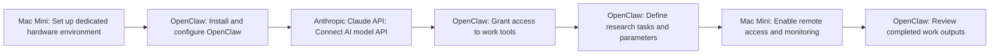

# You Need to Hear This Update...

**Use Case:** Research Analysis
**Skill Level:** ⭐⭐⭐ Advanced
**Estimated Cost:** $300/day in Claude Opus API credits + $600-800 one-time for Mac Mini hardware
**Complexity:** High
**Value Score:** 9/10
**Source:** [The AI Advantage](https://www.youtube.com/watch?v=KFVUQAYHwzI)
**Published:** 2026-02-18

## Overview

OpenClaw is an open-source AI agent that operates autonomously with full computer access to complete end-to-end tasks without human intervention. The creator uses it for research work that previously required human employees, running it remotely on a dedicated Mac Mini with significant API costs ($300/day mentioned).

## Tech Stack

- **OpenClaw**
- **Anthropic Claude API**
- **Mac Mini**

## Workflow Diagram

## Step-by-Step

1. **[Mac Mini]** Set up dedicated hardware environment
   - Purchase and configure a Mac Mini as dedicated machine for OpenClaw to operate independently
2. **[OpenClaw]** Install and configure OpenClaw
   - Open-source installation with full system permissions, browser access, and tool integrations
3. **[Anthropic Claude API]** Connect AI model API
   - Configure Claude Opus API access for the agent's reasoning and decision-making capabilities
4. **[OpenClaw]** Grant access to work tools
   - Provide agent with access to Notion, email, Google Docs, and other necessary work tools
5. **[OpenClaw]** Define research tasks and parameters
   - Set up repetitive research processes that previously required human workers
6. **[Mac Mini]** Enable remote access and monitoring
   - Configure remote control to monitor agent operations from different locations
7. **[OpenClaw]** Review completed work outputs
   - Check results of autonomous research and task completion without needing to intervene during execution

## When to Use This

- Repetitive research tasks that require multi-step reasoning and tool use
- End-to-end workflows that previously required dedicated human workers
- Tasks requiring browser automation, document creation, and cross-platform coordination
- When you have technical expertise to troubleshoot and configure complex systems
- When API costs are justified by labor replacement value

- If you need secure, production-grade systems (explicitly not secure)
- If you lack technical expertise for troubleshooting and configuration
- For simple automation tasks better handled by traditional tools like Zapier or Make
- When you cannot afford high API costs ($300+/day mentioned)
- If you need intuitive, plug-and-play solutions without steep learning curves
- For tasks requiring human judgment, creativity, or emotional intelligence

## Alternatives

- Traditional automation platforms (Make.com, Zapier) for simpler, more reliable workflows
- AI coding assistants (Cursor, GitHub Copilot) for development tasks
- Specialized AI tools for specific use cases rather than general-purpose agents
- Human virtual assistants for tasks requiring judgment and reliability
- Hybrid approach: AI for prototyping/assistance + human for execution

## Next Steps

- [ ] Test this workflow
- [ ] Customize for your use case
- [ ] Integrate with existing systems
